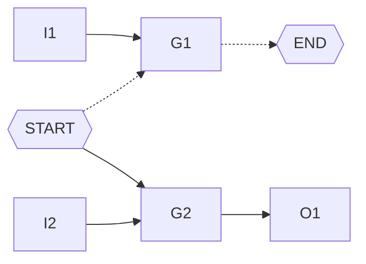

<h1 align=center> VLSI testing - Assignment 1 </h1>

<h3 align="right"> 309510133 - Cheng-Cheng Lo </h3>

[TOC]

## Overwiew

This homework assignment is to find all the possible paths between a designated start node and a designated end node. Since there is no loops or D-type flip-flops in this probelm, the whole circuit can be treated as a directed graph.

## Algorithm

### DFS search

An straightforward approach would be simply using DFS search.
The algorithm is described as follows.

```
func dfs (g, path):
    if g is not end_gate
        for every h in g's fanout 
            dfs(h, path + g)
    if g is end_gate
        print (path + g)
        
dfs(start_gate, "")
```

However, the whole process can be very long. Thus, some modification is inevitable, which will be discussed later.

### BFS search

I also tried BFS search. However, the same situation goes to BFS search. The program doesn't terminate with simple BFS search.

I use BFS search in this program to count all the paths (doesn't store the path).

### Remove gates that don't contribute to the path

Consider the case below. The only path from START to END is the dotted arrow. However, when doing search, the path START --> G2 --> O1 is also considered. It will not know it's an unvalid path until they reach O1, a gate without fanout but not the designated end node. Similar thing goes to BFS search, G2 and O1 will maintain extra useless information and leads to a long execution time.

When the circuit size become bigger, the differcnes will affect the execution time and memory usage significantly. 



So I do a modification here. Before doing any kinds of search, starts from the designated output, marks its fanins as active, and do the same thing treated the fanins as the designated output.

```
func mark_active_gates():
	initialize a queue Q
	push the designated output into Q
	while Q is not empty
	do
		g = pop an element from Q
		mark g as active
		push g's every non-acitve fanins into Q
```

After the whole process, we can be certain that every non-active gates will not contribute to the paths to the designated output. When doing search, we can ignore every non-active gates to speed up the process !

After adding the procedure, the original DFS search becomes:

```
func dfs' (g, path):
    if g is not end_gate
        for every h in g's fanout
        	if h is active // only process active gates !!
        	do
            dfs'(h, path + g)
    if g is end_gate
        print (path + g)
        
func main():
	mark_active_gates()  // mark active gates first
	dfs'(start_gate, "")  // then do the search
```

### Analysis

I use DFS with non-active gates removal in the assignment.

## Test Cases Result 

For a test case, the upper result uses **BFS search**; the bottom uses **DFS search**. I use DFS seach in the assignment, BFS search is for comparison.

### Test Case 1

```
./atpg -path -start G3 -end PO_G16 c17.bench
```

```
Start parsing input file
Finish reading circuit file
G3 net17 G16 PO_G16
G3 net14 net18 G16 PO_G16
The paths from G3 to PO_G16: 2
total CPU time = 0.000239
```

```
Start parsing input file
Finish reading circuit file
G3 net14 net18 G16  PO_G16
G3 net17 G16  PO_G16
The paths from G3 to PO_G16: 2
total CPU time = 0.000293
```

### Test Case 2

```
./atpg -path -start 126GAT_30 -end PO_863GAT_424 c880.bench
```

```
( ... ignores above ...)
The paths from 126GAT_30 to PO_863GAT_424: 4
total CPU time = 0.002918
```

```
( ... ignores above ...)
The paths from 126GAT_30 to PO_863GAT_424: 4
total CPU time = 0.001906
```

### Test Case 3

```
./atpg -path -start 126GAT_30 -end PO_863GAT_424 c880.bench
```

```
( ... ignores above ...)
The paths from 307GAT_18 to PO_2548GAT_840: 468
total CPU time = 0.023831
```

```
( ... ignores above ...)
The paths from 307GAT_18 to PO_2548GAT_840: 468
total CPU time = 0.018417
```

### Other Test Cases

|    bench    |  START  |      END       |     number of paths      | total CPU time |
| :---------: | :-----: | :------------: | :----------------------: | :------------: |
| c6288.bench | 52GAT_3 | PO_2548GAT_840 |          10935           |    0.070132    |
| c6288.bench | 1GAT_0  |  4946GAT_1876  |   3145728 (~3 million)   |    4.62375     |
| c6288.bench | 1GAT_0  |  5308GAT_2031  |  12582912 (~13 million)  |    20.1643     |
| c6288.bench | 1GAT_0  |  6123GAT_2368  | 805306368 (~800 million) |    1384.64     |
| c6288.bench | 1GAT_0  |  6150GAT_2378  |        3221225469        |    17483.8     |

The problem becomes much easier if we don't need to print all the paths.

The case of max path count of the circuit "c6288.bench" is START: 273GAT_16,  END: 6288GAT_2447.
The paths from 273GAT_16 to 6288GAT_2447: **2834910994482262608**, which takes less than 0.1 seconds to count but hours to print all the paths.

It's also a huge burden to store such results or even compare them.                         

2834910994482262608

3221225469

## Build

```
make
./atpg -path -start <PI> -end <PO> <circuit_name>
```
