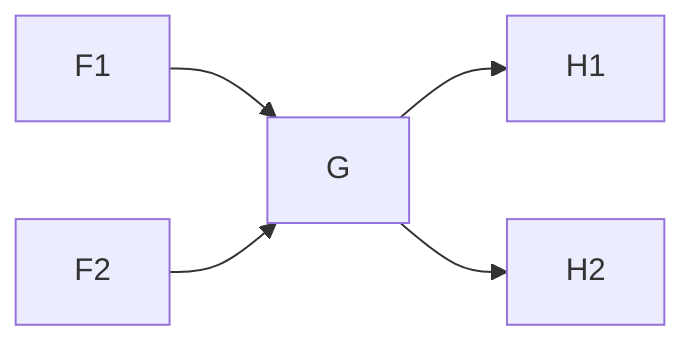

## Implementation

For every gate, I maintain following information:

* a flag tells whether it will affect the end gate

* number of fanins that haven't been processed yet
* list of path (i.e. list of string)
* number of paths

Let's consider the case below.

All the paths from the start node to F1 are [p1, p2, ..., pn]; 

All the paths from the start node to F2 are [q1, q2, ..., qm].

For tha gate G, is has 2 fanins, F1--> G and F2 --> G, so all the paths from the start node to G would be [p1, p2, ..., pn, q1, q2, ..., qm] with G appended to the end of every paths.

Let's consider G's affect to its fanouts, G --> H1 and G --> H2.

H1 has fanin G, it may have other fanins. But what we can be certain is there are paths from the start node to H1, and the paths are [p1, p2, ..., pn, q1, q2, ..., qm] with G and H1 appended to the end of every paths. The similar mechanism goes to H2 or any other G's fanouts.

## 