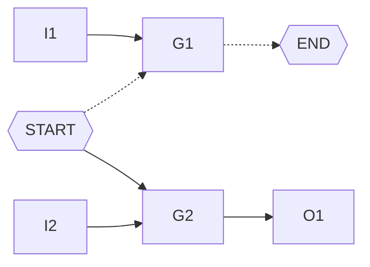
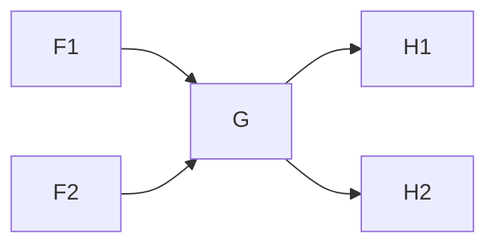

<h1 align=center> VLSI testing - Assignment 1 </h1>

<h3 align="right"> 309510133 - Cheng-Cheng Lo </h3>

[TOC]

## Overwiew

This homework assignment is to find all the possible paths between a designated start node and a designated end node. Since there is no loops or D-type flip-flops in this probelm, the whole circuit can be treated as a directed graph.

## Algorithm

### DFS search

An straightforward approach would be simply using DFS search.
The algorithm is described as follows.

```
dfs (g, path)
    if g is not end_gate
        for every h in g's fanout 
            dfs(h, path + g)
    if g is end_gate
        print (path + g)
        
dfs(start_gate, "")
```

However, the whole process can be very long. Thus, some modification is inevitable, which will be discussed later.

### BFS search

I also tried BFS search. However, the same situation goes to BFS search. The program doesn't terminate with simple BFS search.

### Remove gates that don't contribute to the path

Consider the case below. The only path from PI to PO is the dotted arrow. However, when doing search, the path START --> G2 --> END is also considered. It will not know it's an unvalid path until they reach O1, a gate without fanout but not the designated end node. Similar thing goes to BFS search, G2 and O1 will maintain extra useless information and leads to a long execution time.

When the circuit size become bigger, the differcnes will affect the execution time and memory usage significantly. 



So I do a modification here. Starting from the designated output, mark its fanins as active, and do the same thing treated the fanins as the designated output.

```
func mark_active_gates():
	initialize a queue Q
	push the designated output into Q
	while Q is not empty
	do
		g = pop an element from Q
		mark g as active
		push g's every fanins into Q
```

After the whole process, we can be certain that every non-active gates will contribute to the paths to the designated output. When doing DFS or BFS search, we can ignore every non-active gates to speed up the process !

## Implementation

For every gate, I maintain following information:

* a flag tells whether it will affect the end gate

* number of fanins that haven't been processed yet
* list of path (i.e. list of string)
* number of paths

Let's consider the case below.




All the paths from the start node to F1 are [p1, p2, ..., pn]; 

All the paths from the start node to F2 are [q1, q2, ..., qm].

For tha gate G, is has 2 fanins, F1--> G and F2 --> G, so all the paths from the start node to G would be [p1, p2, ..., pn, q1, q2, ..., qm] with G appended to the end of every paths.

Let's consider G's affect to its fanouts, G --> H1 and G --> H2.

H1 has fanin G, it may have other fanins. But what we can be certain is there are paths from the start node to H1, and the paths are [p1, p2, ..., pn, q1, q2, ..., qm] with G and H1 appended to the end of every paths. The similar mechanism goes to H2 or any other G's fanouts.

## Test Cases Result 

### Test Case 1

```
./atpg -path -start G3 -end PO_G16 c17.bench
```

```
Start parsing input file
Finish reading circuit file
print path
-------
G3 net17 G16 PO_G16
G3 net14 net18 G16 PO_G16
The paths from G3 to PO_G16: 2
total CPU time = 0.000239
```

### Test Case 2

```
./atpg -path -start 126GAT_30 -end PO_863GAT_424 c880.bench
```

```
Start parsing input file
Finish reading circuit file
print path
-------
126GAT_30 517GAT_227 517GAT_227b 543GAT_236 581GAT_250 581GAT_250b 654GAT_270 734GAT_287 773GAT_351 789GAT_368 789GAT_368b 802GAT_372 808GAT_377 808GAT_377b 826GAT_391 837GAT_396 846GAT_407 855GAT_418 863GAT_424 PO_863GAT_424
126GAT_30 517GAT_227 517GAT_227b 543GAT_236 581GAT_250 651GAT_271 722GAT_295 763GAT_337 773GAT_351 789GAT_368 789GAT_368b 802GAT_372 808GAT_377 808GAT_377b 826GAT_391 837GAT_396 846GAT_407 855GAT_418 863GAT_424 PO_863GAT_424
126GAT_30 517GAT_227 517GAT_227b 543GAT_236 581GAT_250 581GAT_250b 654GAT_270 734GAT_287 773GAT_351 773GAT_351b 788GAT_367 788GAT_367b 802GAT_372 808GAT_377 808GAT_377b 826GAT_391 837GAT_396 846GAT_407 855GAT_418 863GAT_424 PO_863GAT_424
126GAT_30 517GAT_227 517GAT_227b 543GAT_236 581GAT_250 651GAT_271 722GAT_295 763GAT_337 773GAT_351 773GAT_351b 788GAT_367 788GAT_367b 802GAT_372 808GAT_377 808GAT_377b 826GAT_391 837GAT_396 846GAT_407 855GAT_418 863GAT_424 PO_863GAT_424
The paths from 126GAT_30 to PO_863GAT_424: 4
total CPU time = 0.002918
```

### Test Case 3

```
./atpg -path -start 126GAT_30 -end PO_863GAT_424 c880.bench
```

```
( ... ignores above ...)
The paths from 307GAT_18 to PO_2548GAT_840: 468
total CPU time = 0.023831
```


## Build

```
make
./atpg -path -start <PI> -end <PO> <circuit_name>
```
