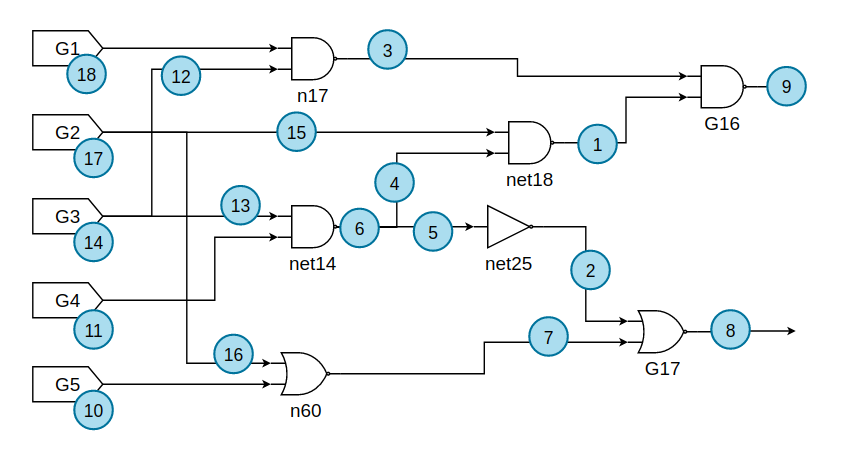
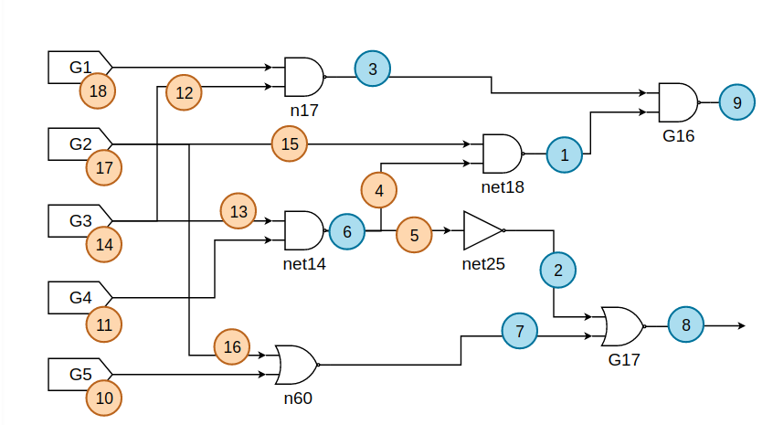

<h1 align=center> VLSI testing - Assignment 4 </h1>

<h3 align="right"> 309510133 - Cheng-Cheng Lo </h3>

[TOC]

## Part.a

### Checkpoint Theorem

Checkpoint theorem tells us that we only have to consider those faults on primary input and fanout branches. Take c17.bench for example, the original faults happens at the blue point shown below.

There 18 points in total with two kinds of faults at each point, which is 36 total.

When we use checkpoint theorem, we only consider those faults on primary input and brach fanouts. Hence, some faults are discarded. Those faults remain are shown in orange below.

Those faults in blue are discarded.

### Implementation

The implementation on finding checkpoints is easy. For a gate, there are following possibilities.

* primary input: is **checkpoint**
* primary output: is NOT checkpoint
* gates in between (gptr)
  * with no branch: is NOT checkpoint
  * with branches (i.e. gptr->No_Fanout > 1): is **checkpoint**

### Test Cases

|    bench    | original faults | faults (checkpoint theorem) | % of faults have been collapsed |
| :---------: | :-------------: | :-------------------------: | :-----------------------------: |
|  c17.bench  |       36        |             22              |             61.1111             |
| c499.bench  |      2390       |            1282             |             53.6402             |
| c7552.bench |      19456      |            8098             |             41.6221             |

## Part.b

