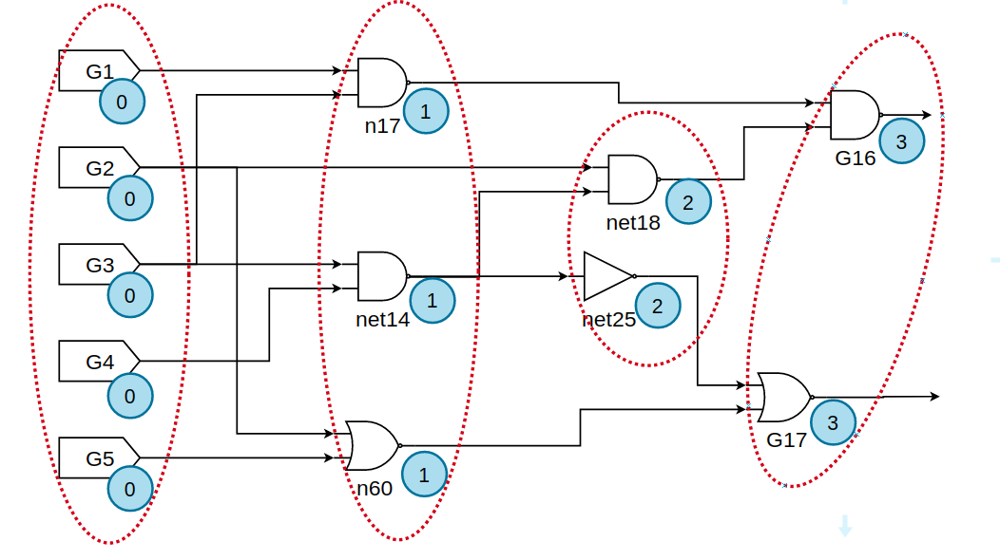

<h1 align=center> VLSI testing - Assignment 4 </h1>

<h3 align="right"> 309510133 - Cheng-Cheng Lo </h3>

[TOC]

## Part.a

### Checkpoint Theorem

Checkpoint theorem tells us that we only have to consider those faults **on primary input and on fanout branches**. Take c17.bench for example, the original faults happens at the blue point shown below.


There 18 points in total with s-a-1 amd s-a-0, two kinds of faults at each point, which is 36 total.

When we use checkpoint theorem, we only consider those faults on primary input and brach fanouts. Hence, some faults are discarded. Those faults remain are shown in orange below.


Those faults in blue are not checkpoints and thus discarded.

### Implementation

The implementation on finding checkpoints is easy. For a gate, there are following possibilities.

* primary input: is **checkpoint**
* primary output: is NOT checkpoint
* gates in between (gptr)
  * with no branch: is NOT checkpoint
  * gptr's branches (i.e. gptr->No_Fanout > 1): are **checkpoints** (but gptr itself is not)

### Test Cases

|    bench    | original faults | faults (checkpoint theorem) | % of faults have been collapsed |
| :---------: | :-------------: | :-------------------------: | :-----------------------------: |
|  c17.bench  |       36        |             22              |             38.8889             |
| c499.bench  |      2390       |            1282             |             46.3598             |
| c7552.bench |      19456      |            8098             |             58.3779             |

## Part.b

### Bridging Faults

Take c17.bench for example, from layer 0 (leftmost) to layer 3 (rightmost), there are 2 * ( 4 + 2 + 1 + 1 ) = 16 bridging faults in total. 



### Algorithm

The algorithm is quite straughtforward, descibed as follows.

```
generates_bridging_faults():
	bridge_faults = {}
	for different layers l:
		for (g1, g2) are adjacent gates in layer l:
			add (g1, g2, AND) to bridge_faults
			add (g1, g2, OR)  to bridge_faults
```

### Test Cases

|    bench    | number of bridging faults (AND + OR) |
| :---------: | :----------------------------------: |
|  c17.bench  |                  16                  |
| c499.bench  |                 1140                 |
| c7552.bench |                11662                 |

